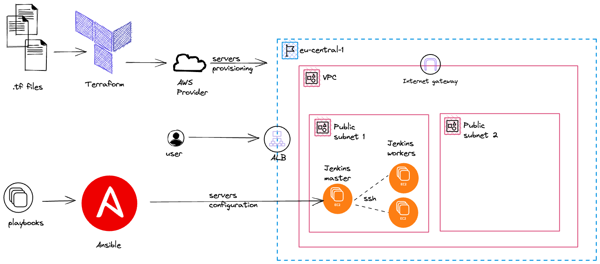

## sandbox for exploring and learning AWS

The goal of this repo is to create a sandbox environment for exploring and learning AWS.
The environment will host a Jenkins cluster that will be used to run CI/CD pipelines.
The Jenkins cluster will be deployed using terraform and ansible.
The deployment architecture will be as follows:



The lab will allow me to learn and practice the following:

* [X] setup docker development container for the controller node
  - [X] install aws cli
  - [X] install terraform
  - [X] install ansible
- [X] setup terraform and configure it to use aws
  - [X] create IAM terraform user with programmatic access
- [X] use s3 bucket to store terraform state
- [X] setup network resources using terraform
  - [X] create VPC, internet GWs and subnets
  - [X] create security groups
  - [X] create ALB to expose Jenkins cluster
- [o] create EC2 instance 
  - [X] use data source to get latest AMI
  - [X] generate and deploy ssh key pair for EC2 remote access
  - [ ] deploy Jenkins master and worker EC2 instances
- [o] setup Jenkins cluster on EC2 
  - [X] setup Ansible AWS Dynamic Inventory
  - [X] setup Ansible template to install Jenkins

## How to run

In order to run the project you need to have docker installed on your machine.
You also need to have an AWS account and create an IAM user with programmatic access.
The IAM user should have the minimal set of permissions required to run the terraform code.

* make sure you put your IAM terraform user credentials inside `src/.aws` folder

```bash
# src/.aws/credentials
[default]
aws_access_key_id = <your access key>
aws_secret_access_key = <your secret key>

# src/.aws/config
[default]
region = <your region>
```

* start development container

```bash
docker-compose up --build
```

* exec into container

```
docker exec -it aws-lab-app-1 bash
```

* run `aws` commands to create s3 bucket to store terraform state

```bash
aws s3api create-bucket --bucket <your bucket name> --region <your region name> --create-bucket-configuration LocationConstraint=<your region name>
```

depending on your region and bucket name you might need to change the `backend.tf` file

```bash
* generate ssh key pair for EC2 remote access (accept the defaults)
```bash
  ssh-keygen -t rsa
```

* run `terraform` commands to provision infrastructure
  - `terraform init`
  - `terraform plan`
  - `terraform apply`

* run `ansible` commands to provision Jenkins cluster
  - see the inventory graph
    - `ansible-inventory --graph`
  - check if ansible can connect to EC2 instances
    - `ansible -t ansible-aws-inventory/ all -m ping`
  - run ad-hoc commands
    - `ansible -t ansible-aws-inventory/ all -a "whoami"`
    - `ansible -t ansible-aws-inventory/ all -a "cat /etc/os-release"`
  - run playbook
    - `ansible-playbook -t ansible-aws-inventory/ ansible-playbooks/jenkins_master.yaml`
