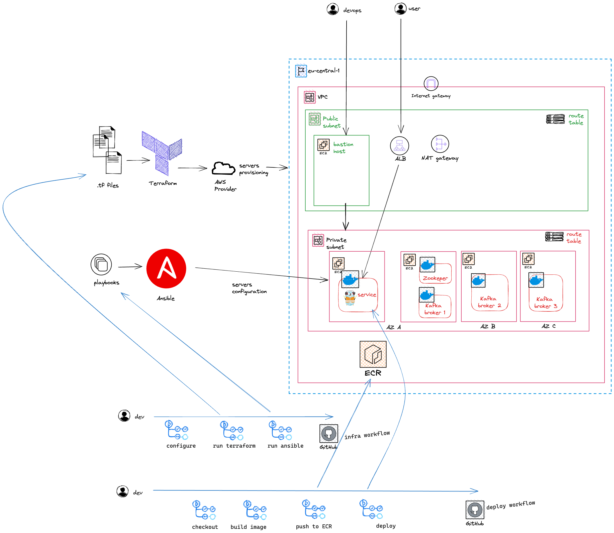

## Kafka lab
The lab environment will host a Kafka cluster of three nodes using Amazon EC2 instances.
Nodes will be running inside self managed docker containers.

In the same private subnet an ECS cluster will host microservices that will produce and consume messages from the Kafka cluster

The entire infrastructure will be provisioned using terraform and ansible and the deployment
automation will be done using Github actions

The deployment architecture will be as follows:



The lab will allow me to learn and practice the following:

* [X] Set up CI pipeline for infrastructure provisioning and deployment:
  - [X] Use Terraform to provision the AWS infrastructure
  - [X] Use Ansible to configure the EC2 instances
  - [X] Use GitHub Actions to automate the CI pipeline.
* [X] Set up classic three tier AWS architecture:
  - [X] Setup private and public subnets with bastion host in public subnet and kafka nodes and ECS cluster in private subnet
  - [X] Provision EC2 instances based Amazon Linux 2 AMI.
  - [X] Provision ECS cluster for hosting containerized microservices.
  - [X] Setup ALB for load balancing and routing traffic to ECS cluster.
  - [X] Ensure that the instances have appropriate security groups, and network settings:
      - [X] allow inbound and outbound traffic for Kafka ports (e.g., 9092) only between the EC2 instances within the private subnet.
      - [X] allow inbound traffic for SSH from the bastion host only.
* [X] Set up Kafka cluster:
  - [X] Install docker & docker-compose on each EC2 instance to facilitate containerization.
  - [X] Install other tools like `netcat` and `jq` to facilitate testing and debugging.
  - [X] Install Kafka on all EC2 instances within the cluster. 
       - [X] Use [bitnami](https://github.com/bitnami) docker images that run in user mode and do not require root privileges.(in particular user ID 1001)
       - [X] Create a docker-compose.yml files for each cluster node. These files will define the services and configurations for the Kafka cluster.
       - [X] Configure Kafka and ensure that the Kafka instances have sufficient resources and are properly networked within the EC2 cluster.
       - [X] Install ZooKeeper on first EC2 instance only and colocate it with Kafka broker running already on the same server. (cost optimization, not a best practice)
* [X] Set up ECS cluster:
  - [X] For each microservice create a Dockerfile that defines the container image.
  - [X] Use appropriate base image for Go applications and specify the necessary dependencies and build instructions.
  - [X] Create ECS service and task definition for each microservice.
  - [X] Build the Docker image for each microservice using a command like docker build -t <image-name> ..
  - [X] Deploy microservices on the ECS cluster:
  - [X] Configure the microservices to connect to the appropriate Kafka broker(s) and subscribe to the relevant topics.
* [o] Set up load balancing and networking:
  - [X] Configure an applications load balancer to distribute incoming traffic across the ECS instances running the microservices.
  - [ ] Ensure that the load balancer is properly configured to handle the gRPC communication ports for each microservice.
* [X] Apply security best practices to secure the EC2 instances, including using security groups to control inbound and outbound traffic, configuring SSL/TLS for gRPC communication, and securing access to Kafka and other services.
* [ ] Monitor and scale:
  - [ ] Implement monitoring and logging mechanisms to track the health and performance of the deployed system. Use tools like CloudWatch, Prometheus, or ELK stack for monitoring and log analysis.
  - [ ] Set up autoscaling policies to automatically scale the ECS cluster based on resource utilization or other metrics.

## How to run

In order to run the project you need to have docker installed on your machine.
You also need to have an AWS account and create an IAM user with programmatic access.
The IAM user should have the minimal set of permissions required to run the terraform code.

* make sure you put your IAM terraform user credentials inside `.aws` folder in the current directory that will be mounted as a volume of the development container 

```bash
# .aws/credentials
[default]
aws_access_key_id = <your access key>
aws_secret_access_key = <your secret key>

# .aws/config
[default]
region = <your region>
```

* start development container

```bash
docker-compose up --build
```

* exec into container

```
docker exec -it lab-kafka-app-1 bash
```

* run `aws` commands to create s3 bucket to store terraform state

```bash
aws s3api create-bucket --bucket <your bucket name> --region <your region name> --create-bucket-configuration LocationConstraint=<your region name>
```

depending on your region and bucket name you might need to change the `backend.tf` file

* generate ssh key pair for EC2 remote access (accept the defaults) and pass public key value to terraform using `public_key` variable

```bash
  ssh-keygen -t rsa
```

* run `make` commands to provision infrastructure
  - `make init`
  - `make plan`
  - `make apply`
  As part of apply stage the `generate-inventory.sh` script will be triggered that generates `ansible-aws-inventory/inventory.ini` config file
  Sample tf output:
  
  ```
  Outputs:

  kafka-node-1-private-ip = "10.0.1.117"
  kafka-node-1-public-ip = "18.195.216.14"
  kafka-node-2-private-ip = "10.0.1.53"
  kafka-node-2-public-ip = "18.195.64.60"
  kafka-node-3-private-ip = "10.0.1.71"
  kafka-node-3-public-ip = "18.195.64.70"
  ```
  
* ssh into provisioned EC2 instances over bastion host

```bash
# ~/.ssh/config

Host bastion
  HostName <bastion-host public ip>
  User ec2-user
  IdentityFile ~/.ssh/id_rsa

Host node-1
  HostName <node-1 private ip>
  User ec2-user
  ProxyJump bastion

Host node-2
  HostName <node-2 private ip>
  User ec2-user
  ProxyJump bastion
```

* run `ansible` commands to provision Kafka cluster
  - see the inventory graph
    - `ansible-inventory --graph`
  - check if ansible can connect to EC2 instances
    - `ansible -t ansible-aws-inventory/ all -m ping`
  - run playbooks
    - `ansible-playbook ansible-playbooks/docker.yaml` - install docker on every node
    - `ansible-playbook ansible-playbooks/kafka-setup.yaml --extra-vars "node_number=1"` - provision kafka node 1
    - `ansible-playbook ansible-playbooks/kafka-setup.yaml --extra-vars "node_number=2"` - provision kafka node 2
    - `ansible-playbook ansible-playbooks/kafka-setup.yaml --extra-vars "node_number=3"` - provision kafka node 3

  - check if it's working and both kafka nodes can communicate: `docker run --tty confluentinc/cp-kafkacat kafkacat -b <kafka-node-private-ip>:9092 -L` (you need to run this command from a kafka node)

## CI/CD

The entire process described above was automated.
The project uses GitHub Actions for CI/CD. The pipeline is defined in `.github/workflows/infra.yaml` file.
The pipeline is triggered manually from GitHub UI. It consists of 2 main stages:
- `terraform` - runs terraform commands to provision AWS infrastructure
- `ansible` - runs ansible playbooks to install docker and provision kafka cluster
`destroy` input parameter is used to destroy the infrastructure. If it's set to `true` then the pipeline will destroy the infrastructure instead of creating it.

Additional pipeline `.github/workflows/deploy_service.yaml` file is triggered automatically on every push to `main` branch.
It builds docker image and pushes it to AWS ECR repository. Then it deploys the image to ECS cluster.
